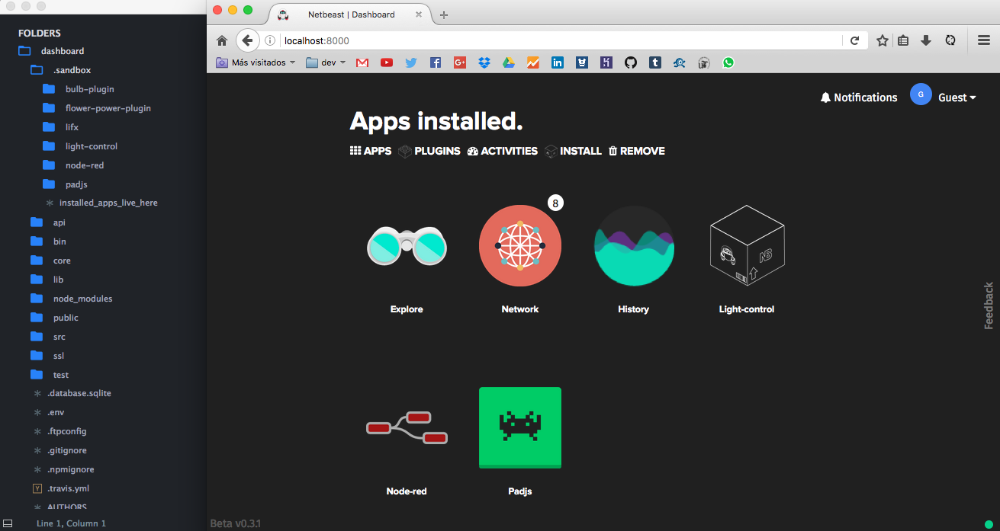

# Debugging
 Netbeast Dashboard clones or downloads apps to a `_apps` folder relative to its root. Move apps there for them to be listed on *installed apps* or *installed plugins*.
 

*Node-red, Padjs and Light-control installed. The rest of apps are native to the Dashboard*

```
mv yourapp <dashboard path>/_apps
```

If you installed the dashboard with `npm install -g netbeast-cli` they are often installed under `/usr/local/lib/node` or `/usr/local/lib/node_modules` in \*nix systems. In windows you can try `C:\Program Files (x86)\nodejs\node_modules`.

#### Restart the app
 Sometimes you have to stop your app and tell node to run the new source. You can achieve it with tools like [nodemon](http://nodemon.io/). If you want the Dashboard to relaunch it (e.g: you are using Netbeast API and need environment variables) run: 
```bash
beast restart <your app name> # each time you need it
```
#### Compiling assets
 We are frequently creating apps with React or other technologies that need  preprocessing. Copy it as well to the Dashboard, use `beast restart` when needed and simply run in parallel:
```
npm run build # or
gulp # or
grunt # or
webpack
```

Or whatever your favorite tools are.