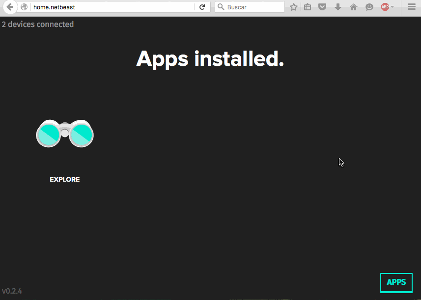

# Install a plugin on the Dashboard

Once you have created your first plugin, you will be able to install it on the dashboard as the same way as you do with an application. 

You can do it in some different ways:


### 1. Install a plugin through Netbeast Market

People can publish their apps & plugins on github and they will be able to people directly on the dashboard. If you want to see more information about this, go [here](http://docs.netbeast.co/chapters/publish_applications_and_plugins/index.html)

Then, you only need to click on the "explore" icon and then look for that apps and plugins you want to install.

Really easy





### 2. Install a plugin through github

1. Firstly you need to upload your plugin to a github repository.

2. Secondly, go to the >Install secction on the dashboard and then click on the option "with git". After that, you only need to copy your repository name there and click on "install".

3. Finally you will have your plugin installed.


### 3. Install a plugin through Drag & Drop

First you need to package your folder plugin in a .tar.gz format

#### Package your plugin
```
beast pkg .
# alias for "netbeast package"
```

Will output app.tar.gz

**But you could do that also manually!** Using the UNIX compressing tool:
```
tar -zcvf plugin.tar.gz directory-name
```
Or a standard desktop compressor.


#### Drag & Drop

Drag and drop the above resulting file to the dashboard, or go to the 'install' section from the tool bar and follow the instructions.


### 4. Install through SDK
```
beast install plugin.tar.gz
```
It will prompt to ask you which Netbeast to install in if there are a number of them running in the same network.


