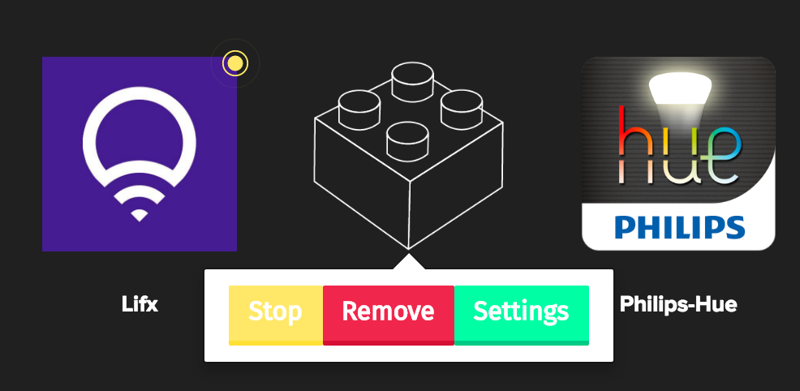

# Write your first Plugin

A Netbeast plugin is a kind of "application" that allow you to control device from a concrete brand through the [Netbeast API](../../api_reference/index.md)
It's the sauce behind Netbeast API engine. With a plugin you can register a resource for others to use, like a new brand of smart bulbs to be controlled as another _light_ source.

If you want to control a device that it´s yet not supported by Netbeast. You can **create a plugin
and make it available for all the community**.

> Lets connect everything!

In this section we are going to explain how to create a plugin for real products. However, you can still learn and try how to create plugins with Netbeast without any real product on this secction: [Write a virtual plugin](write_a_virtual_plugin.md)

___

## Plugin structure
```
cd DASHBOARD_DIR/_apps # Now it will appear under "installed apps"
netbeast new myplugin --plugin
```

A new folder named _myplugin_ will contain some code scaffolded.

**A basic Netbeast plugin looks like this:**
```
myplugin
├── settings
|   └── index.html
├── README.md
├── index.js
├── package.json
└── test.js
```

##package.json
package.json is the information needed by npm to maintain a module into their repositories, analyze dependencies and establish some development workflow.

Netbeast will make use of this file to reduce the overhead of configuration needed to get up and running. It will look for the `main`field in order to launch and executable. For this app:
```json
{
    "name":"myplugin",
    "version": "1.0.0",
    "description":" A short description about what is your plugin for.",
    "main": "index.js",
    "netbeast": {
      "bootOnLoad": true,
      "type": "plugin",
      "settings": true
    },
    "dependencies": {
      "async": "^1.4.2",
      "body-parser": "^1.14.0",
      "chai": "^3.2.0",
      "commander": "^2.8.1",
      "express": "^4.13.3",
      "fs": "0.0.2",
      "http": "0.0.0",
      "mocha": "^2.3.2",
      "morgan": "^1.6.1",
      "netbeast": "^1.0.2",
      "request": "^2.62.0",
      "socket.io": "^1.3.7"
    },
    "devDependencies":{},
    "scripts":{
        "test":"node test.js",
        "start": "node index.js"
    },
    "repository": {
        "type":"git",
        "url":"https://github.com/netbeast/docs"
    },
    "keywords": [ "iot","netbeast","netbeast.co", "plugin"],
    "author": "pablo@netbeast.co",
    "license": "GPL 2",
    "bugs": {
        "url":"https://github.com/netbeast/docs/issues"
    },
    "homepage":"https://github.com/netbeast/docs"
}

```

The field `bootOnLoad` allows the plugin to start on boot.
Put `settings: true` it allows you to create a settings route accesible through the dashboard



**IMPORTANT**: don´t forget to fill `type` as *plugin*.

## index.js

This file already implements callbacks for the main actions that a plugin should support: **discover**, **get**, **set**, and **settings**.

**It is mandatory for `main` to be and executable file.** So make sure it can be executed:
```
chmod +x index.js
```
As you can see in the code, **the main file must accept the port by parameter**, so they can all be opened from the [Dashboard](https://github.com/netbeast/dashboard).

## discover

We use this callback to know when the user or Dashboard is asking as to scan the network for new devices.

After scanning, we should:
  1. Register the device in the database.
  2. If the device is not available anymore, we should delete it from the database

```javascript
/*
* Discover your resources / scan the network
* And declare your routes into the API
*/

app.get('/discover', function (req, res) {
	/* TODO, implement discovery */

  /* Then you have 2 options +/

	/* for each device */
	netbeast('topic').create({ app: 'my-first-plugin', hook: 'DEVICE_ID' })
	/* end of for */
  /* and check the DB to delete the resources not availables */


	/* or */


	/* Register all device together and delete the resources no longer available with only this method */
	netbeast('topic').udateDB({ app: 'my-first-plugin', hook: ['DEVICE1_ID', 'DEVICE2_ID', 'DEVICE3_ID', 'DEVICE4_ID'] })

  res.json(DEVICES_FOUND)
})

```

Each device has different discovery methods. If you still having doubts or don't know how to proceed, **check the existing plugins** in our [GitHub](http://github.com/netbeast). Open an [issue](https://github.com/netbeast/dashboard/issues) or ask on our [forum](//forum.netbeast.co).

## GET, SET

In this file you will receive the request from Netbeast API. And you should translate
it to the proper methods. We have 3 routes.

```javascript

/*
* Create here your API routes
* app.get(...), app.post(...), app.put(...), app.delete(...)
*/

app.get('/:device_id', function (req, res) {
	// id of the device the dashboard wants
	// << req.params.device_id >>
	// dashboard will do GET on this route when
	// netbeast('topic').get({})

	/* TODO: Return device values from req.query */

	// res.json({ YOUR_PLUGIN_DATA })
})

app.post('/:device_id', function (req, res) {
	// id of the device the dashboard wants
	// << req.params.device_id >>
	// dashboard will do POST on this route when
	// netbeast('topic').set({})

	/* TODO: Change device values from req.body */

	// res.json({ YOUR_PLUGIN_DATA })
})

```

Use `get('/:id')` to gather info from the device like in this example.
The parameters that you should look for are provided in `req.query`.

```javascript
var colorsys = require('colorsys')
var bulbvalues = {power: 'on', brightness: 'bri', saturation: 'sat', hue: 'hue'}

router.get('/hueLights/:id', function (req, res, next) {
    api.lightStatus(req.params.id, function (err, data) {
      if (err) return res.status(404).send('Device not found')

      if (!Object.keys(req.query).length) return res.json(_parsePhilips(data.state))
      var response = {}
      Object.keys(req.query).forEach(function (key) {
        if (key === 'color') {
          response['color'] = { hex: colorsys.hsl2Hex(data.state.hue, data.state.sat, data.state.bri),
                             rgb: colorsys.hsl2Rgb(data.state.hue, data.state.sat, data.state.bri) }
        }
        if (bulbvalues[key]) response[key] = _parseKeyGet(key, data.state[bulbvalues[key]])
      })
      if (Object.keys(response).length) return res.json(response)
      return res.status(202).send('Values not available on this philips-hue bulb')
    })
  })
```

Use `post('/:id')` to change the device status like in this example.
The parameters that you should modify are provided in `req.body`.

```javascript
var ledpanel = require('ledpanel')

router.post('/ledPanel/:id', function (req, res, next) {
  //req.body = {power:on/off, data:[]}
  if (!req.body.power) return res.status(400).send('Incorrect format {power:on/off, data}')

  if (req.body.power === 'off') {
    ledpanel.clear(function(err) {
      if(err) return res.status(400).send('A problem setting one value occurred')
      return res.send({power: req.body.power})
    })
  } else {
    ledpanel.matrix(req.body.matrix, function(err) {
      if(err) return res.status(400).send('A problem setting one value occurred')
      return res.send(req.body)
    })
  }
  return res.status(400).send('Incorrect format {power:on/off, data}')
})
```
If you use `netbeast new myplugin --plugin` to create a plugin, you will find this
info and much more inside. You can find more examples on our [GitHub](http://github.com/netbeast).

## Settings
An HTML is served with all default styles and some fields to make it easier to create forms and send info back to the plugin.

## test.js

This file is empty, but is a good practice to develop some test for your plugin.
