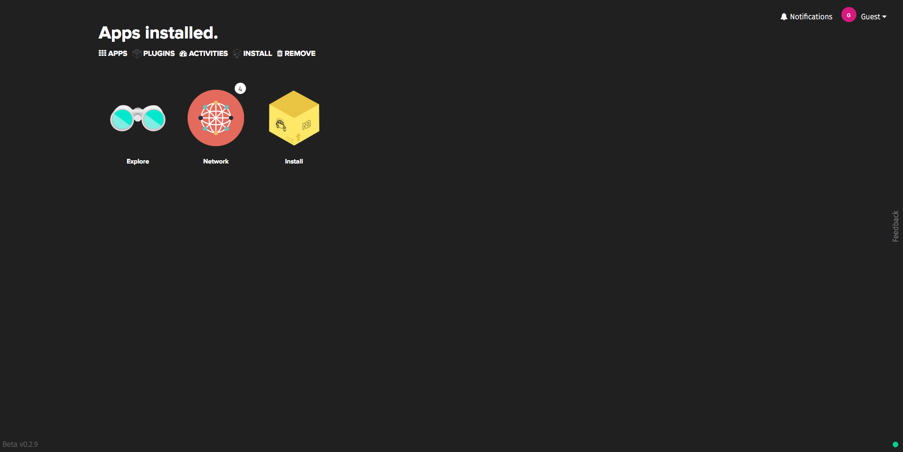
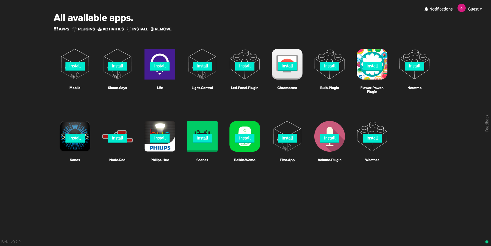
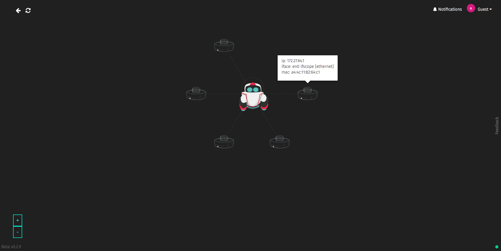
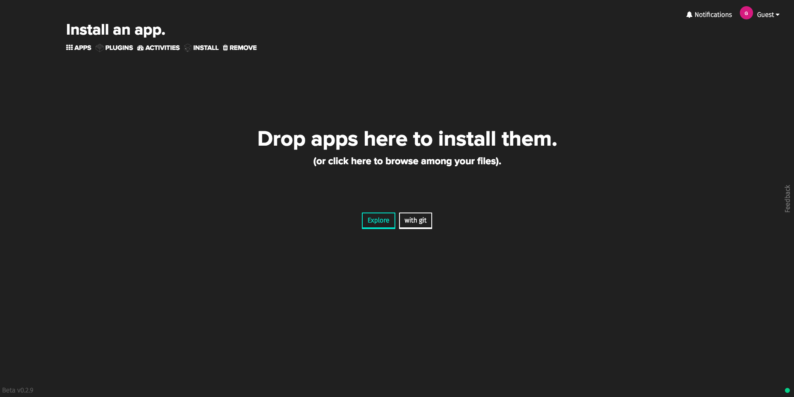

# The Dashboard

The Dashboard is the UI to access the applications you develop. It allows to install apps both locally and from our app repository. It also allows to manage running apps and to view information about the devices that Netbeast is connecting.

In the main screen, the following options are available:

* **Explore**: allows you to browse the applications that are on our apps repository.

* **Network**: allows you to view information about the devices that Netbeast is connecting.

* **Install**: allows you to manually install an application.

On the menu bar, you can access the apps and plugins installed, manage the apps that are running and install & remove apps.

