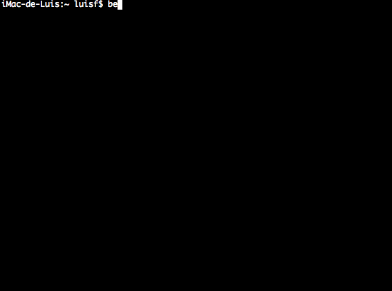

## Discover your Netbeast

If you connect your Netbeast to your router, maybe you don't want to disconnect from your router network to access to your Netbeast.

For doing this, you should know what the IP address of your raspberry pi is on the router network.

* First open your favorite terminal. 

* The install the netbeast package if you haven't done it yet.
```
npm install netbeast-cli -g
```
* Once you have the npm package installed just run this command on your terminal
```
beast scan
```

Automatically, this command will show you what is the netbeast ip address on your router network and you can access through ssh for example.


